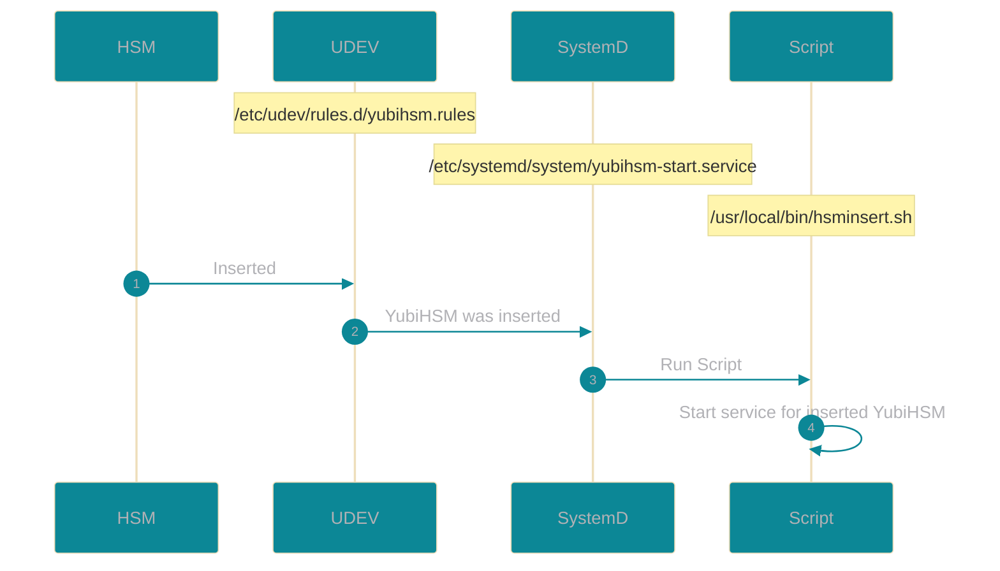

# SSH Signer

#### Summary

The goal of this applicaiton is to make an easy to deploy SSH CA environment. Passing the signing auhtority off to key organization individuals.
By using the YubiHSM as the backbone of this architecture you not only have a more secure storage facility but also visibility to who is signing and when they are signing ssh keys.


#### My Random Notes

- UDEV script (yubihsm.rules) will trigger the SystemD service (yubihsm-start.service). SystemD service will execute the hsminsert.sh script.

<details><summary>On YubiHSM insert</summary>



</details>

- My test RPi has an oled screen. The IP address will show of the device. Script located at application/xscripts/oled.py


#### RUN

```bash
python3 app_signer.py
```


##### TODO

- [ ] Installation README with requirements
- [ ] Installation scripts
- [X] UDEV script to configure YubiHSM on insert
- [X] Create "timestamp" cert
- [ ] Create Login Page
- [ ] Create Sign Key page
- [ ] Create walk through video
- [ ] Create systemd script for oled and app
- [ ] Update this README file